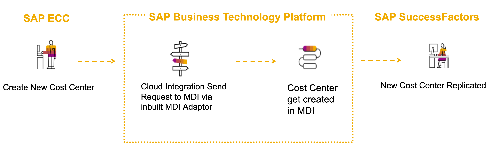
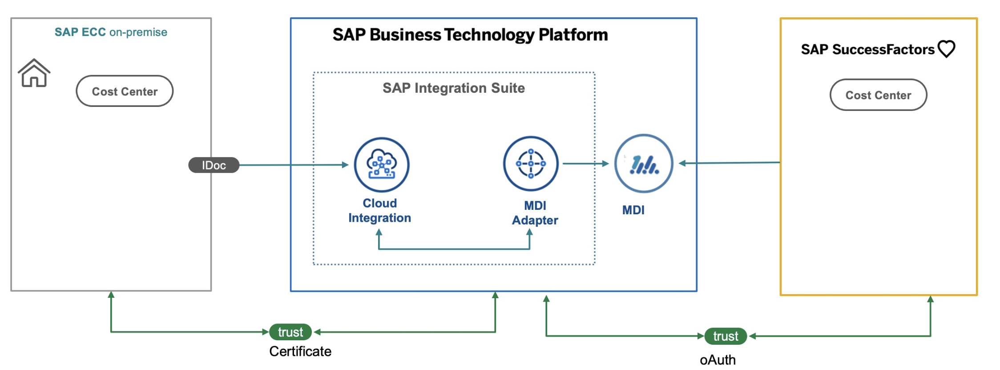

## Master Data Synchornization Between SAP and Legacy System using SAP Cloud Integration

## Purpose

The main intent of this scenario is to provide developers with a practical demonstration of how to efficiently synchronize master data between SAP and non-SAP systems using integration suite and Master Data Integration (MDI) tools. This end-to-end scenario showcases the ease and effectiveness of the integration process, allowing developers to understand the methodology and apply it to their own projects. 

Here are the key highlights of the end-to-end scenario showcased in this scenario:

 - Setting up [Master Data Integration (MDI)](https://help.sap.com/docs/SAP_MASTER_DATA_INTEGRATION) and [Master Data Orchestration (MDO)](https://help.sap.com/docs/SAP_MASTER_DATA_INTEGRATION/8ce78b673ef04cc1bcfeb01c93ef7885/0bed505b149b4ec6af24bf503a45708b.html) for Cost Center.
 - Building an integration flow on [SAP Integration Suite](https://help.sap.com/docs/integration-suite) for data synchronization between SAP ECC and MDI.
 - Consuming the [SAP Master Data Integration Receiver Adapter](https://help.sap.com/docs/integration-suite/sap-integration-suite/e91e373bbb5b49ccbc2977152def61a2.html) to synchronize your master data from SAP applications like SAP ECC with SAP MDI service.
 - Configuring [SAP SuccessFactors](https://help.sap.com/docs/SAP_SUCCESSFACTORS_HXM_SUITE) to integrate with the MDI to create and update Cost Center master data.
 - Configuring SAP ECC to send [IDOC](https://help.sap.com/docs/SAP_NETWEAVER_750/8f3819b0c24149b5959ab31070b64058/4ab074b6aa3a1997e10000000a421937.html) for Cost Center to Cloud Integration, which will trigger the integration flow on SAP Integration Suite for data synchronization

Overall, This scenario contains documentation with step-by-step instructions to guide developers through the entire integration process, enabling them to implement a robust and reliable data synchronization solution.

## Business Scenario

ACME Corporation is a large enterprise that operates multiple business systems to manage their operations efficiently. They have an SAP ECC system that is used for finance and accounting, while their HR department uses SAP SuccessFactors to manage employee data. ACME has recently created a new set of cost centers in their SAP ECC system, and they want to ensure that the data is synchronized with their HR system in real-time.

To achieve this, ACME has decided to implement a Master Data Integration (MDI) solution using integration suite. The MDI solution will ensure that the cost center data is synchronized between the SAP ECC and SAP SuccessFactors systems in real-time, ensuring consistency and accuracy of data across the enterprise.

The business scenario for ACME Corporation would involve the following steps:

1. **Configuring SAP ECC to send IDOCs for Cost Center to Cloud Integration**: Acme would need to configure their SAP ECC system to send IDOCs (Intermediate Documents) for Cost Center to Cloud Integration. The IDOCs would contain the Cost Center master data, which would then be used by the MDI solution to synchronize the data with SAP SuccessFactors.

2. **Building an integration flow on SAP Integration Suite**: ACME would need to build an integration flow on SAP Integration Suite to ensure that the Cost Center master data is synchronized in real-time. This would involve using the [SAP Master Data Integration Receiver Adapter](https://help.sap.com/docs/integration-suite/sap-integration-suite/e91e373bbb5b49ccbc2977152def61a2.html) to read the data from the SAP ECC system and send it to MDI.

3. **Configuring SAP SuccessFactors to integrate with the MDI**: ACME would need to set up the necessary configurations in SAP SuccessFactors to enable the system to integrate with the MDI solution. 

4. **Testing and Deployment**: Once the integration flow has been built, ACME would need to test it to ensure that the data is synchronized correctly. They would also need to deploy the solution to their production environment and ensure that it is running smoothly.

In conclusion, the business scenario for Acme Corporation involves implementing a Master Data Integration solution using Integration Suite to synchronize Cost Center master data between their SAP ECC and SAP SuccessFactors systems in real-time. By doing so, ACME would ensure that their data is consistent and accurate across the enterprise, improving operational efficiency and decision-making capabilities.

## Architecture

### Solution Diagram

The architecture involves SAP ECC sending Cost Center data in IDOC format to SAP Integration Suite on SAP Business Technology Platform (BTP). The integration flow on SAP Integration Suite processes the Cost Center data and creates/updates the Cost Center in the Master Data Integration (MDI) through [SAP Master Data Integration Receiver Adapter](https://help.sap.com/docs/integration-suite/sap-integration-suite/e91e373bbb5b49ccbc2977152def61a2.html). The MDI then replicates the Cost Center data to SAP SuccessFactors, which is integrated with the MDI through inbuilt business scnearios. This ensures that Cost Center data is synchronized across SAP ECC, SAP Integration Suite, MDI, and SAP SuccessFactors in real-time, improving data consistency and operational efficiency.

## Where to Start?

* Follow the below steps for quick start or start the [SAP Discovery Center Mission]().

	| **Step**    |  **Description** | 
	| ----------- | ---------------- | 
    | [Step 1: Prepare](./documentation/setup/README.md) | Complete all the setup required to run the scenario | 
    | [Step 2: Design and Deploy Integration Flow](./documentation/implement/cpi/README.md) | Design and Deploy iFlow. If you want ready made sample, download from the releases | 
    | [Step 3: Configure SAP ERP(ECC) System](./documentation/implement/ecc/README.md) | Configure the setup in SAP ECC to trigger the iDOC to integration suite | 
    | [Step 4: Configure SAP Successfactor](./documentation/implement/sf/README.md) | Configure the setup in SAP Successfactor to pull master data from MDI |  
    | [Step 5: Run the Scenario](./documentation/complete/test-e2e/README.md) | Run End to End Scenario |  

## Known Issues

No known issues.

## How to Obtain Support

In case you find a bug, or you need additional support, please [open an issue](https://github.com/SAP-samples/cloud-mdi-integration/issues/new) here in GitHub.

## License
Copyright (c) 2023 SAP SE or an SAP affiliate company. All rights reserved. This project is licensed under the Apache Software License, version 2.0 except as noted otherwise in the [LICENSE](LICENSES/Apache-2.0.txt) file.

