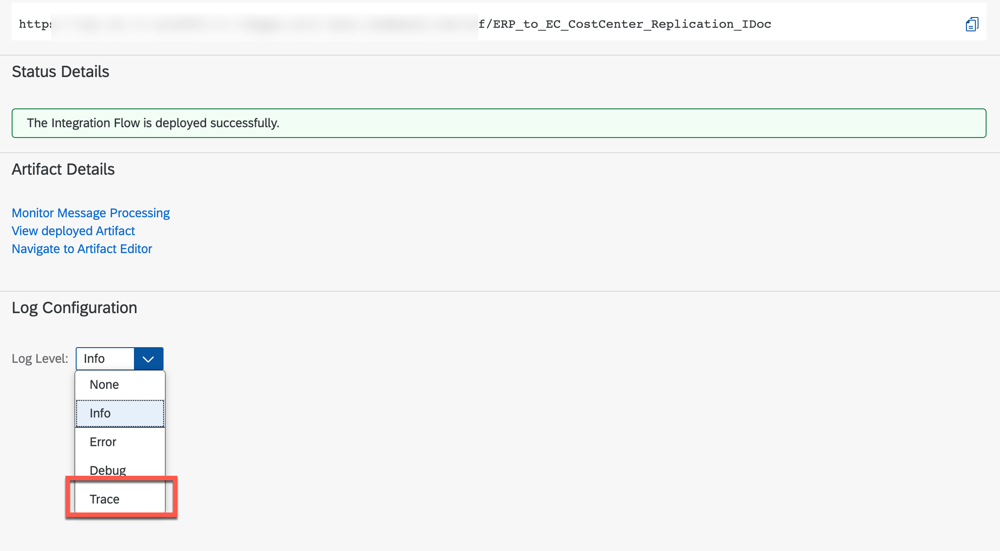
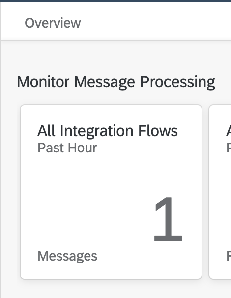
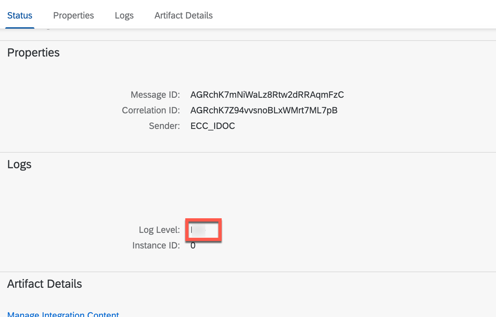

# Monitoring and Troubleshooting

## 1. Monitor IDoc in SAP ECC

You can check the status of outbound IDoc and act accordingly. If the IDoc is failed, then we have to to revisit the backend configuration and review all our steps.

1. Get the IDoc number after executing report.

    

2. Enter Transaction **BD87**.

3. In the **IDoc Number** field, enter the number which you have fetched after running report. Execute the transaction.

    

4. If the IDoc is success, you will get a log **Data passed to port OK** with green icon. If the icon is in red, it means there is a failure in IDoc and then you have to revisit the backend setup.

    

## 2. Monitor logs in SAP Integration Suite.

1. In the **Manage Integration Content**, Choose Log Level in **Trace** mode.

    

2. Run the end to end scenario 

3. Choose **Monitor Messsage Processing** and then choose **All Integration Flows**

    

4. In the Logs, Choose **Trace** and check if any there is any failure in iflows and act accordingly.

    

