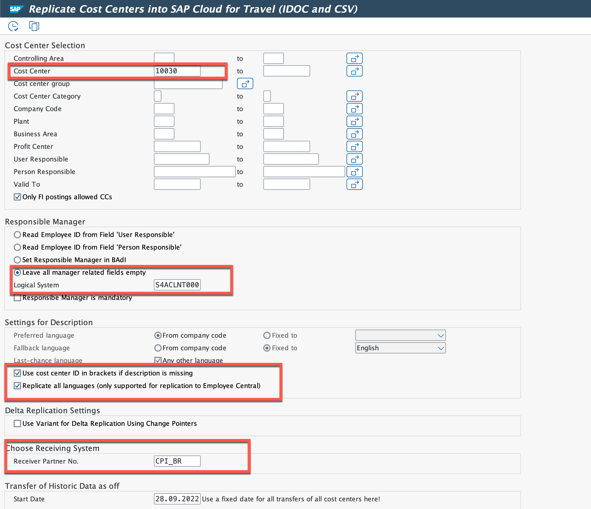

# Run the Scenario

## 1. Create Cost Center in SAP ECC

1. Login to GUI.
2. Enter Transaction **KS01**.
3. In the **Create Cost Center: Initial Screen** , enter below:
    1. Enter **Controlling Area**.
    2. In the **Cost Center** field, enter **10030**.
       > If this exists, then enter next number.
    3. In the **Valid From** field, choose **Current Date**.

4. Choose **Master Data**.

    

5. In the **Create Cost Center: Basic Screen**, Choose **Basic Data** and Enter below field.

    1. In the **Name** field, enter **Refapp**.
    2. In the **Descriptions**, enter **Refapps Cpst Center**.
    3. Enter **Person Responsible**.
    4. Enter **Cost Center Category**.
    5. Enter **Hierarchy area**.
    6. Enter **Currency**.
    7. Enter **Profit Center**.
     > Few of the above entries is dependent on the master data maintained in your ECC system.
    8. Chooe **Save**.

    

## 2. Run Report in SAP ECC

1. In the GUI, enter transaction **SE38**.
2. In the **Program Name**, enter **ODTF_REPL_CC**
3. Choose **Execute**.

    

4. Enter the below fields to run the report:

    1. In the **Cost Center** field, Enter **10030**.
    2. In the **Logical System** field, enter **S4ACLNT000**.
    3. Tick **Use cost center ID in brackets if decription is missing**.
    4. Tick **Replicate all languages**
    4. In the **Receiver Partner No.** field, enter **CPI_BR**.
    5. In the **Processing Mode**, choose **Send IDOC**.

    

    6. Choose **Execute** to run the report.

    

5. Idoc is successully generated and sent to cloud integration.

    

## 3. Verify the Status of iFlow in Cloud Integration

1. Login to Cloud integration.
2. Choose **Monitor < Integrations**.

    

3. In the *Monitor Message Processing**, choose **All Intgrarion Flows Messages**

    

4. If the iflow is executed successfully, you will see the status as completed.
  > For failed iflows, troubleshooting is required in **Trace** mode.

  

## 4. Verify the Cost Center in SAP Master Data Integration.

1. Access the MDI log API in your postman.
2. Hit **GET** request.
3. You will find the cost center.

## 5. Verify the Cost Center in SAP Succssfactor

1. Login to successfactor tenant.
2. In the Business Scenarios **Cost Center Replication from SAP Master Data Integration to EC**:
    1. Choose **Run Now**.
    2. Refresh the **Last Run Time**.
    3. If it's turn **green**, it means the run is successful.

    

3. In the **home screen**, Choose **Manage Data**.

    

4. In the **Search** bar, choose **Cost Center**, and choose the **Refapps Cost Center**.

    

