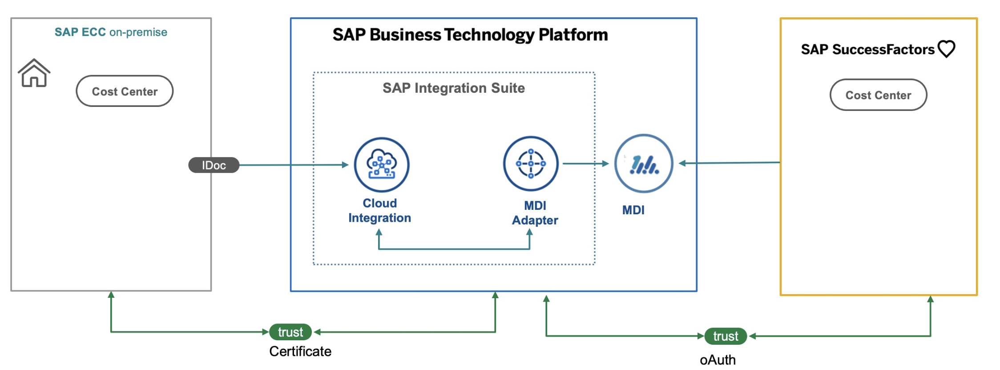
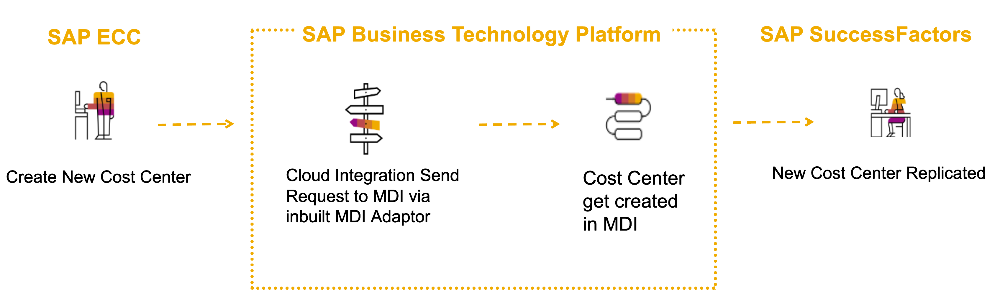

# Learn about the goal and outcome of the mission

The main intent of this scenario is to showcase how to synchronize Master Data between SAP and non SAP system via CPI and MDI.

## Business Scenario

Business Scenario: ACME Corporation would like to have Master Data synchornized between their Business Systems. New Cost Centers are created in legacy SAP ECC system. ACME would like this to be synchornized with their HR system which is SAP Successfactors.

### Solution Diagram

### Process FLow

