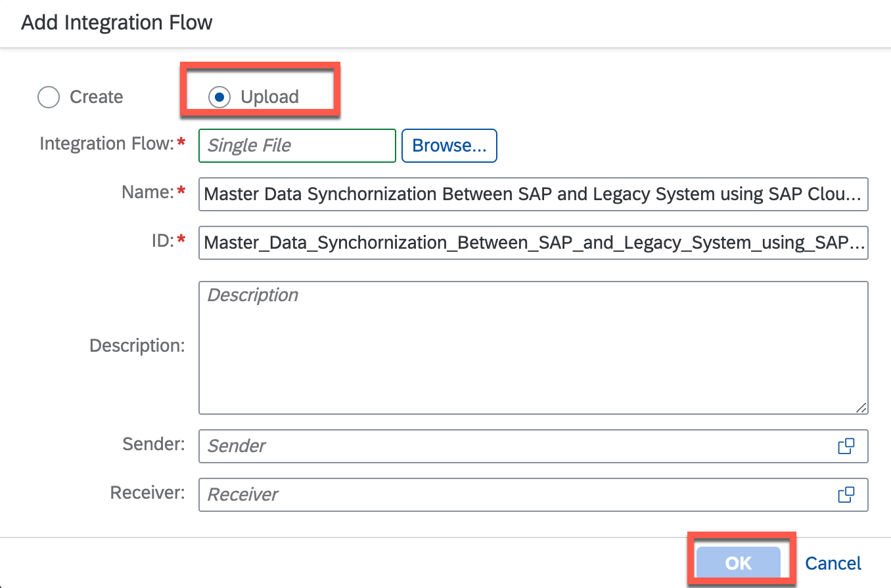
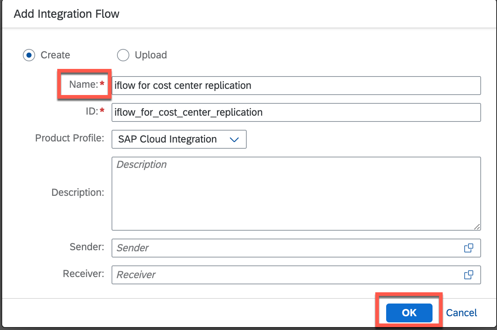
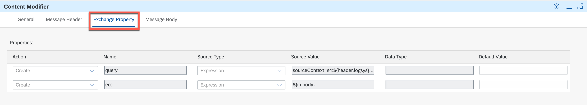
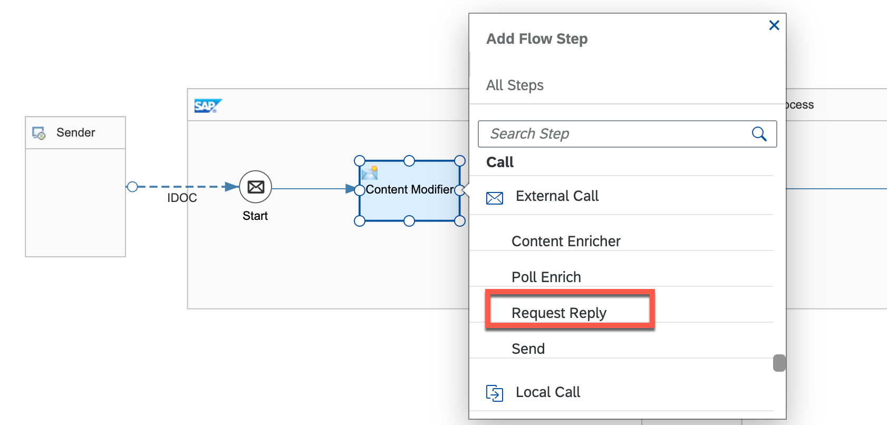
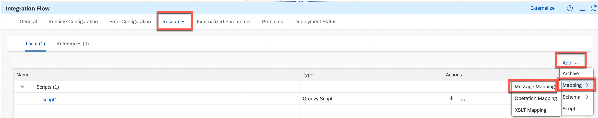
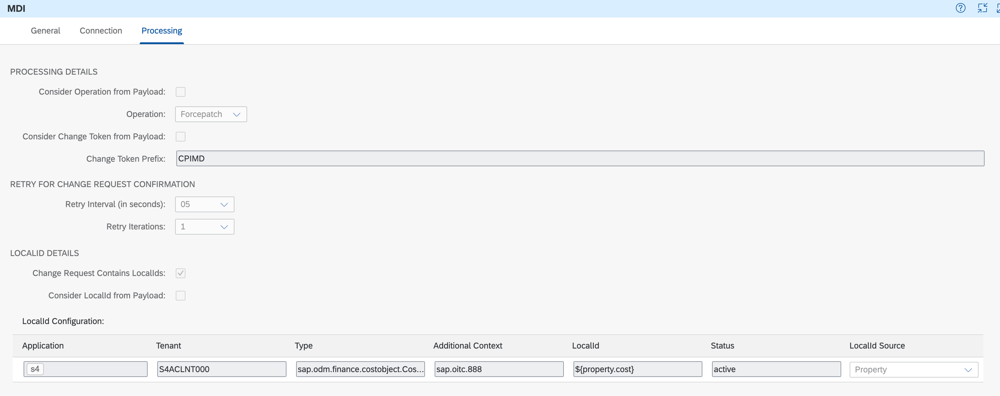
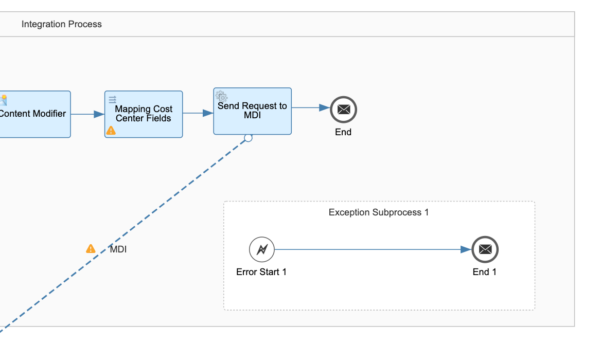
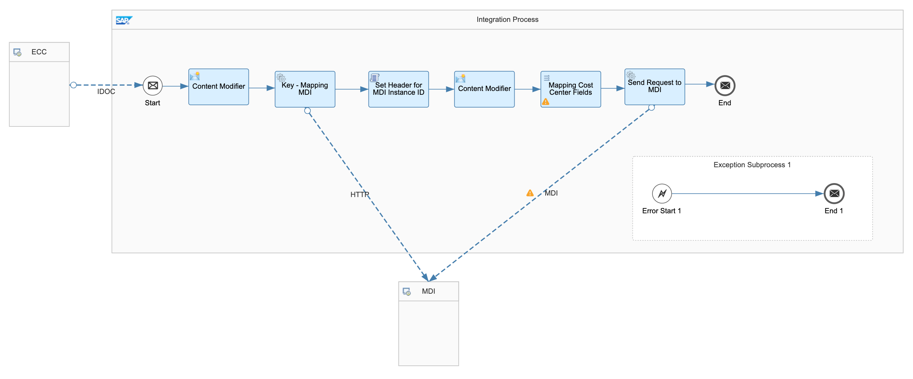

# Design and Deploy Integration Flow

A key part of an SAP Cloud Integration project is to develop integration flows. An integration flow allows you to specify how SAP Cloud Integration is to process a message. SAP Cloud Integration provides a modeling environment that allows you to design the details of message processing (its senders and receivers as well as the individual processing steps) with a graphical user interface.

This section shows you step by step on how to develop and run integration flows which replicate incoming cost center fron SAP ECC to SAP Master Data Integration.

## 1. Manage Security

The Manage Security Material area provides an overview of security-related artifacts. Here, you will configure security for SAP Master Data Integration.

1. Login to CPI Tenant.
2. Expand the Navigation pane and switch to the **Monitor > Integrations**

	

3. In the **Manage Security**, choose **Security Material**.

	

4. Choose **Create**.
5. Choose **OAuth2 Client Credentials**.

	

6. In the **Create OAuth2 Credentials wizard**, enter below:

	1. In the **Name** field, enter **MDICredential**. This name will be used later in iflow.
	2. In the **Description** field, enter **MDI Connection**
	3. In the **Token Service url** field, enter **url**/oauth/token. You will find **url** from **uaa.url** in **MDI Service Key**.
	4. In the **Client ID** field, enter client id which will get from **uaa.clientid** in MDI Service Key.
	5. In the **Client Secret** field, enter client secret which you will find from **uaa.clientsecret** in **MDI Service Key**
	6. In the **Client Authentication** dropdown, chooe **Send as Request Header**.
	7. In the **Content Type** dropdown, chooe **application/json**.
	8. Choose **Deploy**.

	

## 2. Create Package

An integration flow should be associated with an integration package. Here we will create a new package for integration flows.

1. Login to CPI Tenant.
2. Expand the Navigation pane and switch to the **Design > Integrations**

	

3. In the **Design** area, choose **Create**

	

4. In the new package:
	1. In the **Name** field, enter **Cost Center Replication from ECC to SuccessFactors via MDI**
	2. In the **Short Description** field, enter **Cost Center Replication from ECC to SuccessFactors via MDI**

	

5. In your package, switch to the **Artifacts** tab

	

6. From the **Add** menu, choose the entry **Integration Flow** to create a new integration flow

	

## 3. Add Integration Flow(iFlow)

You use this procedure to create an integration flow for enabling communication between two heterogeneous applications or systems. The integration flow is a graphical model that consists of endpoints (systems, interfaces and channels) and flowsteps (activities that enable integration). When you create an integration flow, a corresponding integrated configuration is created in the Integration Directory. 

Here you can either **import our ready made iFlow** and skip all the below steps of manual creation or else **follow the manual iflow creation** for your learning.

### 3.1 Import Ready Made iFlow

Download the **Master.Data.Synchornization.Between.SAP.and.Legacy.System.using.SAP.Cloud.Integration.zip** file from [Releases](https://github.com/SAP-samples/cloud-mdi-integration/releases/tag/v1.0.0-alpha) and save into your local file.

1. In the **Add Integration Flow** dialog:
    1. Choose **Upload**
	2. In the **Integration Flow** field, choose **Browse**
	3. Choose **Master.Data.Synchornization.Between.SAP.and.Legacy.System.using.SAP.Cloud.Integration.zip** from local file.
	4. Choose **OK**

	

2. Choose **Actions** and then choose **Configure**

	

3. In the field **MDIURI**, enter MDI uri you get from service key.

	

4. Choose **Deploy**

	

5. Once the deployment is done, skip all the below steps and directy jump to section 14 **Get the EndPoint of Deployed iflow** .

### 3.2 Manual Create iFlow

Here you will create iflow from scratch which will help you in much more better understanding of implementation.

1. In the **Add Integration Flow** dialog:
    1. Choose **Create**
	2. In the **Name** field, enter **iflow for cost center replication**
	3. Choose **OK**

	

2. Choose your new integration flow **iflow for cost center replicatio** to enter the integration flow editor.

	

3. Within the integration flow editor, switch to the Edit mode by chossing button **Edit** on the top right

	

4. To have enough space for modeling the integration flow steps, we will rearrange and resize the components
	1. First, select the **Receiver** box and place it below the main process pool.
	2. Then, select the right edge of the **Integration Process** box and pull it further right to make the box wider.
	3. Finally, drag and drop the **End Message event** further right so that the whole integration flow stub looks like in the picture below.

	

5. In the properties of the **Sender** connection:
	- In the **Name** field, Enter **ECC**

6. In the properties of the **Receiver** connection:
	- In the **Name** field, Enter **MDI**

	

## 4. Maintain the connection to your IDoc

The IDoc adapter enables SAP Cloud Integration to exchange Intermediate Document (IDoc) messages with systems that support communication via SOAP Web services. Here we will integrate IDoc Adaptor which act an in incoming channel for cost center from SAP ECC.

1. If you choose the **ECC** component, the quick menu appears. From the quick menu, choose the **Connector** icon and drag it on the **Start** Message event

	

2. A dialog comes up where you need to choose the adapter type. In our case, choose the entry **IDOC**

	

3. In the properties of the **IDOC** connection, switch to tab **Connection**
	1. In the **Address** field, enter **/ERP_to_EC_CostCenter_Replication_IDoc**
	
	

4. Choose **Save**.

## 5. Maintain the Content Modifier

The Content Modifier allows you to modify a message by changing the content of the data containers that are involved in message processing (message header, message body, or message exchange). In this section, we will set cost center, key-mapping queries, incoming payload and modify the data accordingly.

1. If you select the **Start** Message event of the Integration Process pool, the quick menu appears. Choose the **Plus** icon of the quick menu.

	

2. In the upcoming menu, Choose the **Content Modifier** entry. Cloud Integration capability provides the AI-powered assistance to simplify and accelerate integration development, you will see that the Content Modifier listed as a recommended step here.

	

3. A Content Modifier step has been added to your integration flow model right after the Start Message event. Choose **Content Modifier**.

4. In the properties of the **Content Modifier**, switch to tab **General**.
	1. In the **Name Field**, Enter **Content Modifier**.

5. In the properties of the **Content Modifier**, switch to tab **Message Header**.
	1. Choose **Add**.
	2. Add below property:

		| **Action**    |  **Name** | **Source Type** |**Source Value** | **Data Type** |
		| ----------- | ----------- |  ----------- |  ----------- |  ----------- | 
		| **Create** | **logsys**  | **XPath** | **/ns2:ODTF_CCTR01/ns2:IDOC/ns2:E101ODTF_S_COST_CENTER_REPL/ns2:BUS_DOC_BS_IDOC_LOG_SYS_ID** |  **java.lang.String** | 
		| **Create** | **cost** | **XPath** | **/ns2:ODTF_CCTR01/ns2:IDOC/ns2:E101ODTF_S_COST_CENTER_REPL/ns2:E101ODTF_S_COST_CENTER_DATA/ns2:REMOTE_EXTERNAL_OBJECT_ID** | **java.lang.String** | 


6. In the properties of the **Content Modifier**, switch to tab **Exchange Modifier**.
	1. Choose **Add**.
	2. Add below property:

		| **Action**    |  **Name** | **Source Type** |**Source Value** | **Data Type** |
		| ----------- | ----------- |  ----------- |  ----------- |  ----------- | 
		| **Create** | **ecc** | **Expression** |  **${in.body}** |  | 
		| **Create** | **query** | **Expression** | **sourceContext=s4:${header.logsys}:sap.oitc.888&sourceKey=${header.cost}&targetContext=mdi:instanceId** |  | 



7. In the properties of the **Content Modifier**, switch to tab **Message Body**. 
	1. In the **Type** dropdown, choose **Expression**.
	2. In the **Body** field, enter below:

	```xml
	<MainRoot>
	${property.ecc}
	<ID>${header.targetKey}</ID>
	</MainRoot>
	```

	

8. Choose **Save**.
		
## 6. Maintain the Request Reply

Certain integration scenarios might require that the Cloud Integration tenant communicates with an external service, retrieves data from it, and further processes the data. In such cases, you can use the request reply step as an exit to connect to the external service.

1. If you select the **Content Modifier** of the Integration Process pool, the quick menu appears. Select the **Plus** icon of the quick menu.

	

2. In the upcoming menu, Choose the **Request Reply** entry. 

	

3. In the properties of the **Request Reply**, switch to tab **General**.

	1. In the **Name Field**, Enter **Key - Mapping MDI**.

	

4. Choose **Save**.


## 7. Maintain the connection to your HTTP Adaptor

Use the HTTP receiver adapter to communicate with SAP Master Data Integration using HTTP message protocol.

1. If you select the Request Reply **Key - Mapping MDI** of the Integration Process pool, From the quick menu, choose the **Connector** icon and drag it on the Receiver **MDI** box.

	

2. A dialog comes up where you need to choose the adapter type. In our case, choose the entry **HTTP**

	

3. In the properties of the **HTTP** connection, switch to tab **Connection**
	1. In the **Address** field, enter **URI/v0/odm/2.1.1/key-maps/sap.odm.finance.costobject.CostCenter**
	> You will find the **URI** from MDI service key. sample URI can be **https://one-mds.cfapps.sap.hana.ondemand.com** 
	2. In the **Query** field, enter **${property.query}**
	3. In the **Proxy Type** dropdown, choose **Internet**
	4. In the **Method** dropdown, choose **GET**
	5. In the **Authentication** dropdown, choose **OAuth2 Client Credentials**
	6. In the **Credential Name** field, choose **MDICredential**

	

4. Choose **Save**.

## 8. Maintain the Groovy Script to Set Header of ID.

1. If you select the Request Reply **Key - Mapping MDI** of the Integration Process pool, the quick menu appears. Select the **Plus** icon of the quick menu.

	

2. In the upcoming menu, Choose the **Groovy Script** entry.

	

3. In the properties of the **Groovy Script**, switch to tab **General**

	1. In the **Name** field, enter **Set Header for MDI Instance ID**.

4. If you select the Script **Set Header for MDI Instance ID** of the Integration Process pool, the quick menu appears. Select the **Create** icon of the quick menu.

	

5. You are now in the script editor.
	1. Remove the existing code and Copy-paste the below code in the editor.

		```groovy
		import com.sap.gateway.ip.core.customdev.util.Message;
		import groovy.json.*

		def Message processData(Message message) {
			def list = new JsonSlurper().parseText(message.getBody(String));
			message.setHeader('targetKey',list.targetKey)
			return message;
		}
		```

	2. Choose **OK**.

6. Choose **Save**.

## 9. Maintain the Content Modifier

1. If you select the **Set Header for MDI Instance ID** Script in Integration Process pool, the quick menu appears. Choose the **Plus** icon of the quick menu.

	

2. In the upcoming menu, Choose the **Content Modifier** entry. Cloud Integration capability provides the AI-powered assistance to simplify and accelerate integration development, you will see that the Content Modifier listed as a recommended step here.

	

3. A Content Modifier step has been added to your integration flow model right after the Start Message event. Choose **Content Modifier**.

4. In the properties of the **Content Modifier**, switch to tab **General**.
	1. In the **Name Field**, Enter **Content Modifier**.

5. In the properties of the **Content Modifier**, switch to tab **Exchange Modifier**.
	1. Choose **Add**.
	2. Add below property:

		| **Action**    |  **Name** | **Source Type** |**Source Value** | 
		| ----------- | ----------- |  ----------- |  ----------- | 
		| **Create** | **targetKey**  | **Header** | **targetKey** |  


6. In the properties of the **Content Modifier**, switch to tab **Message Body**. 
	1. In the **Type** dropdown, choose **Expression**.
	2. In the **Body** field, enter below:

	```xml
	${property.ecc}
	```

	

7. Choose **Save**.

## 10. Maintain the Message Mapping

In the following, we need to map to the format that is required to trigger the Master Data Integration. For your convenience, we have provided a reusable message mapping artifact which maps the XML format of the SAP ECC IDoc to the JSON format of the SAP MDI. 

1. First of all, we need to add the reusable message mapping to the resources of your integration flow. Download the message mapping [CostMDIMap.zip](https://github.com/SAP-samples/cloud-mdi-integration/blob/main/CostMdiMap.zip) and save into your local file.

2. In the properties of your integration flow, switch to the Resources tab

3. Below the Resources tab, switch to the References tab

4. From the Add References menu at the right, select the Message Mapping entry

	

5. Choose the message mapping Map **CostMDIMap.zip** from the local and and choose the **Add** button

	

6. As you can see from the figure below, the mapping has been added to the resources of your integration flow as reference

	

7. Let's now use the mapping in your integration flow model. If you select the **Content Modifier** step of the Integration Process pool, the quick menu appears. Select the **Plus** icon of the quick menu. Choose **Message Mapping**.

	

8. In the properties of the **Message Mapping**, switch to tab **General**. 

	1. In the **Name** field, enter **Mapping Cost Center Fields**

9. In the properties of the **Message Mapping**, switch to tab **Processing**. 

	1. In the **Reference Type** dropdown, choose **Static**.
	2. In the Resource, Choose **Select** and select Mapping **CostMdiMap.mmap**
	3. Choose **OK**.

	

10. Selected mapping will be reflected in Resource.

	

11. Choose **Save**.

## 11. Maintain the Request Reply

1. If you select the Message Mapping **Mapping Cost Center Fields** of the Integration Process pool, the quick menu appears. Choose the **Plus** icon of the quick menu.

2. In the upcoming menu, Choose the **Request Reply** entry. 

	

3. In the properties of the **Request Reply**, switch to tab **General**.

	1. In the **Name Field**, Enter **Send Request to MDI**.

	

4. Choose **Save**.

## 12. Maintain the connection to your MDI Adaptor

We will use SAP Master Data Integration (MDI) receiver adapter to synchronize your master data from SAP applications like SAP ECC and other third-party applications with SAP MDI service.

1. If you select the Request Reply **Send Request to MDI** of the Integration Process pool, From the quick menu, choose the **Connector** icon and drag it on the Receiver **MDI** box.

2. A dialog comes up where you need to choose the adapter type. In our case, choose the entry **MDI**

	

3. In the properties of the **MDI** connection, switch to tab **Connection**
	1. In the **Address** field, enter **URI**
	> You will find the **URI** from MDI service key. sample URI can be **https://one-mds.cfapps.sap.hana.ondemand.com** 
	2. In the **ODM Entity Type** field, enter **sap.odm.finance.costobject.CostCenter**
	3. In the **ODM Entity Version** dropdown, choose **2.1.1**
	4. In the **API Type** dropdown, choose **Requests API**
	5. In the **Authentication** dropdown, choose **OAuth2 Client Credentials**
	6. In the **Credential Name** field, choose **MDICredential**

	

4. In the properties of the **MDI** connection, switch to tab **Processing**
	1. In the **Operation** field, enter **ForcePatch**
	2. In the **Change Token Prefix** field, enter **CPIMD**
	3. In the **Retry Interval (in seconds)** dropdown, choose **05**
	4. In the **Retry Iterations** dropdown, choose **01**
	5. Tick the **Change Request Contains LocalIds** checkbox.
	6. In the **LocalId Configuration**, enter below value:

		| **Application** |  **Tenant** | **Type** |**Additional Context** | **LocalId** | **Status** | **LocalId Source** |
		| ----------- | ----------- |  ----------- |  ----------- | ----------- | ----------- | ----------- | 
		| **s4** | **S4ACLNT000**  | **sap.odm.finance.costobject.CostCenter** | **sap.oitc.888** |  **${header.cost}** | **active** | **Property** |




5. Choose **Save**.

## 12 . Add Exception Subprocess

1.  From the quick menu, choose the **Process** icon and then choose **Exception Subprocess**

	

2. Drag it on the Editor.

3. Choose **Save**.

4. Your final layour look below:

	

## 13. Deploy the iflow

1. Within the integration flow editor , Choose **Deploy**.

	

2. You will get a popup for confirmation. Choose **Yes**.

	

3. You will get a confirmation message that deployment is success.

## 14. Get the EndPoint of Deployed iflow

Onc your iflow is deployed, you will get a deployed URL, which we be later using while configuring backend.

1. Expand the Navigation pane and switch to the **Monitor > Integrations**

	

2. In the **Manage Integration Content**, choose the tile which is started.

	

3. Copy the Endpoint which we be later using while configuring backend.

	


