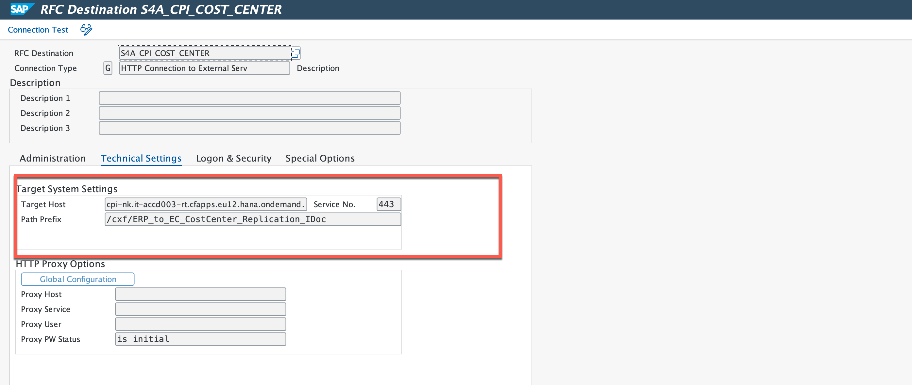
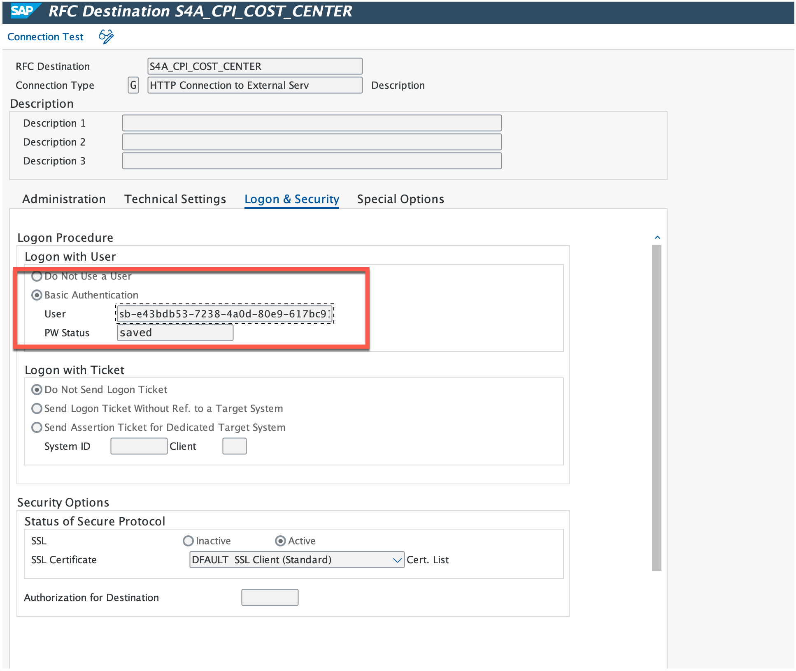
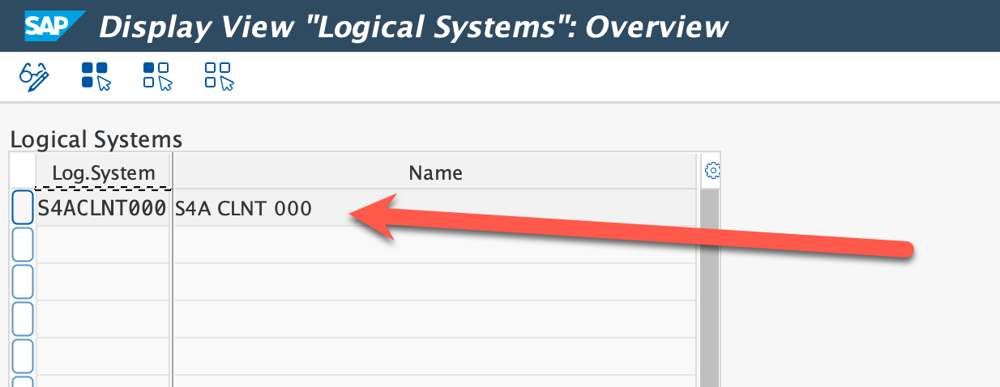
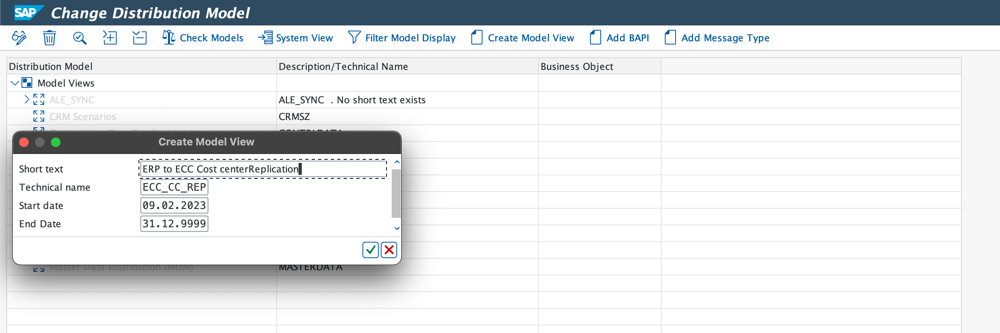
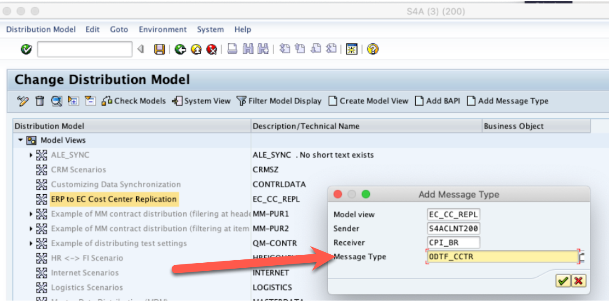
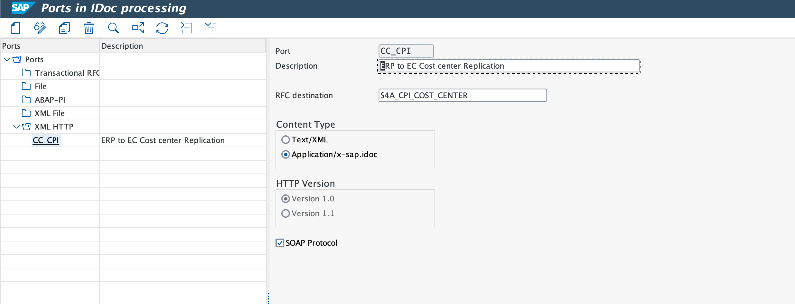
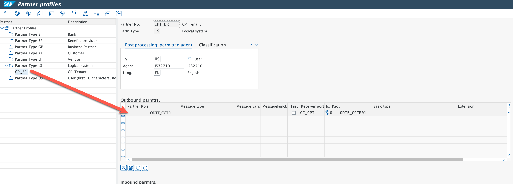
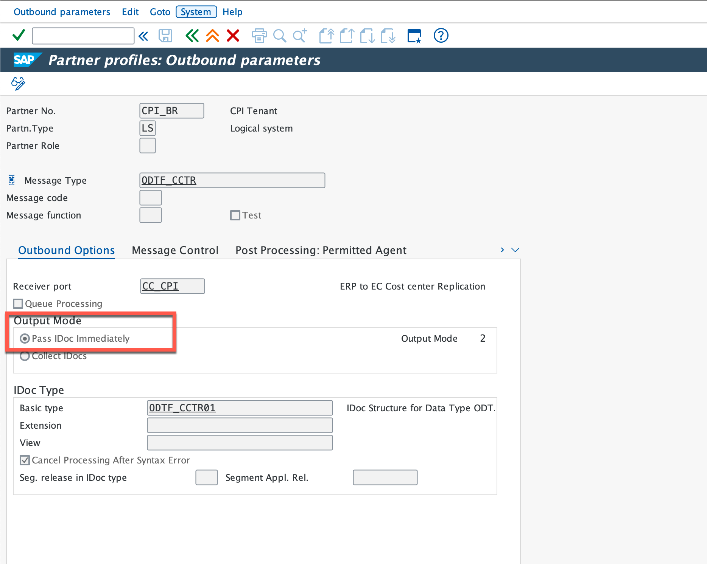

# Configuration in SAP ECC

In this section, we will see how we can enable IDoc and integrate SAP ECC with cloud integration.

The ERP used was **SAP ECC** running **ODTFINCC 600 SP11** and **SAP_BASIS 753 SP 2**.

## 1. Configure the RFC Destination

To access the SAP Cloud Integration, you need to create and configure an RFC destination.

1. Login to your SAP ECC system client with an administration user using SAP GUI.
2. Call Transaction **SM59**.
3. Choose **Create**.
4. In the **Name** field, enter **S4A_CPI_COST_CENTER**.
5. Choose connection type **G**.
6. Choose **Create**.
7. Choose **Technical Settings**.

    1. In the **Target Host** field, enter CPI tenant URL (Don't add https://).
    2. In the **Path Prefix** field, enter CPI tenant prefix.
    3. In the **Service No.** field, enter **443**

        

8. Choose **Logon & Security**.

    1. Choose **Basic Authentication**.
    2. In the **User** field, enter **CPI Service Client ID**.
    3. In the **Password** field, enter  **CPI Service Client Secret**.
    4. In the Security Options, choose SSL **Active**.
    5. In the **SSL Certificate**, choose **Default SSL Client (Standard)**.

    

9. Choose **Save**

10. If the **Connection Test** fails, because of missing trust, you have to import certificate of **process integration service instance** token endpoint and import it into the ECC system through STRUST.

You can follow the step by step guidance on [how to import certificate in ECC](https://github.com/SAP-samples/cloud-extension-ecc-business-process/tree/mission/mission/enable-eventing#download-sap-event-mesh-certificate)

## 2. Define Logical System

The purpose of this activity is to create a logical system for your SAP ERP system

1. Call Transaction **/nBD54**. 
2. Switch to the **Edit Mode**.
3. In the **Log.System** field, **S4ACLNT200**.
4. In the **Name** field, enter descrtiption **S4A CLNT 200**.
5. In the **Log.System** field, enter **CPI_BR**.
6. In the **Name** field, enter descrtiption **CPI BR**.
7. Choose **Save**.

    

## 3. Create a Distribiution Model

The applications that communicate with each other in your distributed systems are specified in the distribution model. The distribution model consists of separate model views where you can define system-wide message flows.

1. Call Transaction **/nBD64**.
3. Switch to the **edit mode**. 
4. Choose **Create Model view**

    1. In the **Short Text Field**, enter **ERP to ECC Cost Center Replication**.
    2. In the **Technical name**, enter **ECC_CC_REP**.
    3. In the **Start Date** field, enter current date.
    4. In the **End Date** field, enter end date. 
    5. Choose **enter**.

    

5. In the **Model View**, choose **ERP to ECC Cost Center Replication**
6. Choose **Add Message Type**

    1. In the **Sender** field, enter **S4ACLNT200**
    2. In the **Reciever** field, enter **CPI_BR**
    3. In the **Message Type** field, enter **ODTF_CCTR**
    4. Choose **enter**

    

7. Choose **Save**.

## 4. Add XML HTTP Port

In this port type, you specify the RFC destination and the content type of the XML messages.

1. Call Transaction **/nWE21**
2. Choose **XML HTTP > CC_CPI**
3. Choose **Create**
4. In the **Content Type** field, choose **Application/x-sap.idoc**
5. In the **RFC destination** field, enter **S4A_CPI_COST_CENTER** 
6. In the **HTTP Version**, choose **Version 1.0**
7. Enable **SOAP Protocol**
8. Choose **Save**

    

## 5. Defining a Partner Profile

A partner profile contains parameters that define the electronic interchange of data between systems using the IDoc interface. Only one partner profile is required per Data Hub installation. The partner profile must contain all parameters required by your scenario to replicate data between the SAP ECC and SAP Cloud Integration.

1. Call Transaction **/nWE20**.
2. Choose **Partner Type LS > CPI_BR**
3. Choose **Create**
4. Choose **Post processing permitted agent**
5. In the **Ty** field, enter **US**.
6. In the **Agent** field, enter your technical user id, 
7. In the **Lang** field, enter **EN** 
8. Choose **+** button of the **Outbound parmtrs**
9. In the **Message Type** field, enter **ODTF-CCTR**
10. In the **Receiver Port** field, enter **CC_CPI**
11. In the **Basic Type** field, enter **ODFT_CCTR01**
12. Choose **Save**

    

13. In the **Message Type** field, Double click on **ODTF_CCTR**
14. In the **Output Mode**, choose **Pass IDoc Immediately**
15. Choose **Save**

    

    

