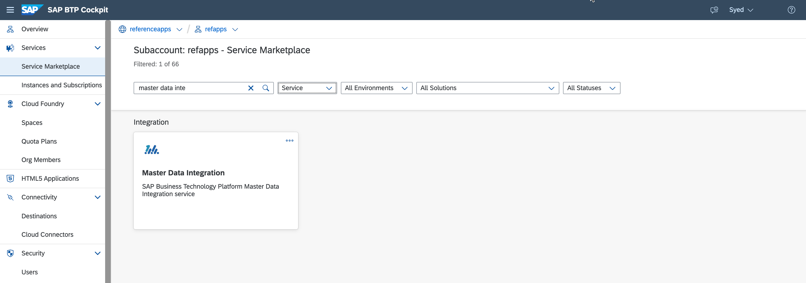
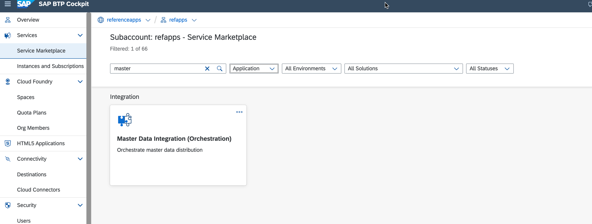
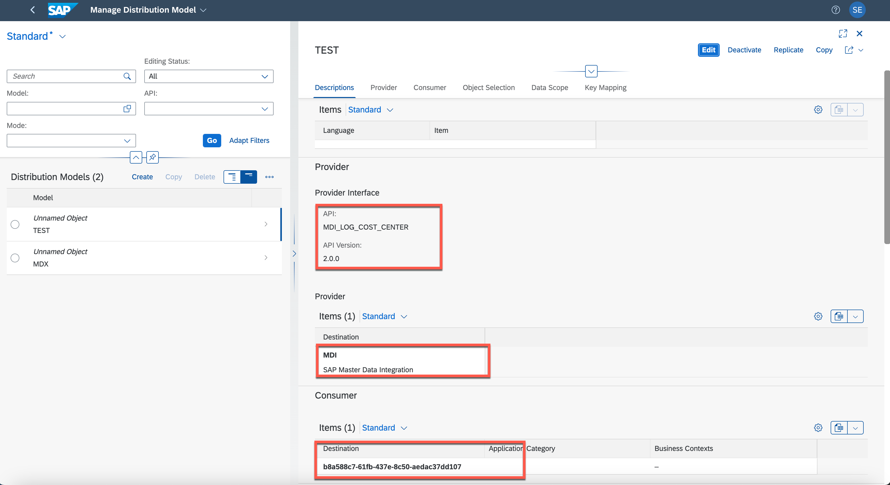

# Configure Master Data Integration(MDI)

## Create MDI Service Instance and Service Key.


Use below Json Parameter

```json
{
  "enableTenantDeletion": true,
  "writePermissions": [
    {
      "entityType": "sap.odm.finance.costobject.CostCenter"
    }
  ]
}
```
## Subcribe and Configure Master Data Orchestration SAAS.





