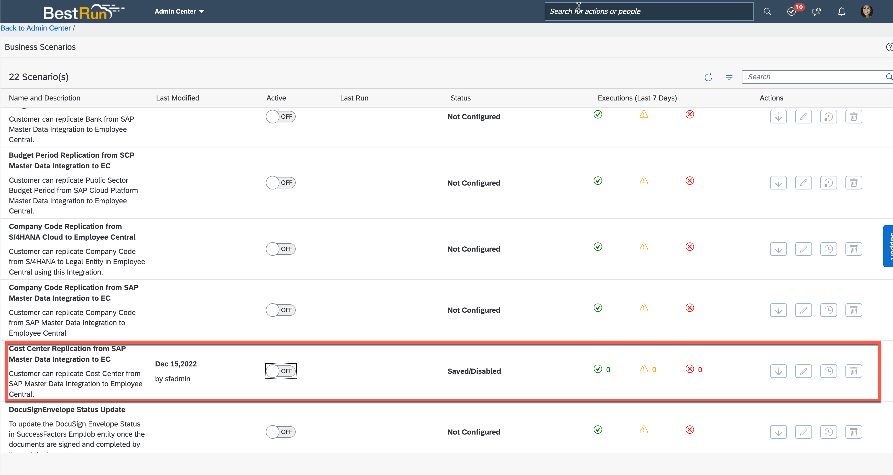
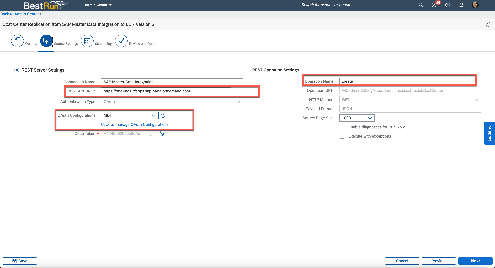
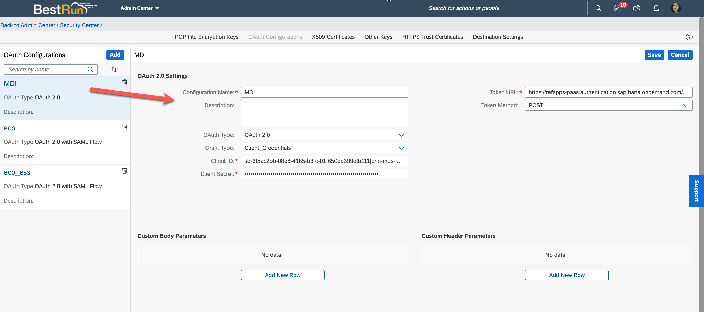

## Configure SAP Successfactor

In the section, we will see how to configure Business Scenarios in SAP Successfactor to enable cost center replication from SAP Master Data Integration.

1. Search **Business Scenarios**.
2. Choose **Cost Center Replication from SAP Master Data Integration to EC**

    

3. In the **Active** section, choose **On**.
4. In the **Actions**, Choose **Edit**
5. In the **REST API URL** field, enter MDI Rest endpoint which you can get it from service key of MDI.
6. In the **Operation Name**, enter**create**
7. In the **OAuth Configurations** field, choose **Click to manage OAuth Configurations**.

    

8. Now you will be navigated to oAuth Configurations page.
    1. Choose **Add**
    2. In the **Configuration Name**, enter **MDI**
    3. In the **OAuth Type**, choose **OAuth 2.0**
    4. In the **Grant Type**, choose **Client_Credentials**
    5. In the **Client ID** field, enter client ID which you can get it from service key of MDI
    6. In the **Client Secret** field, enter client Secret which you can get it from service key of MDI
    7. In the **Token URL** field, enter URL+/outh/token. (you can get URL from service key of MDI)
    8. Choose **Save**

    

9. Choose **Next**.
10. Choose **Save**.

