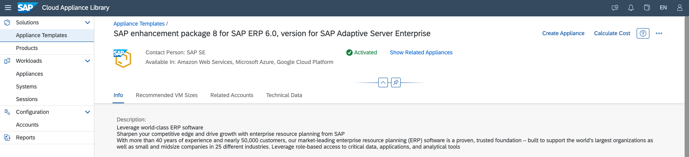

# Create an SAP ERP Test System Using SAP Cloud Appliance Library

If you don't own an SAP S/4HANA system, you could use the 30-day trial version. As a prerequisite, you need either an Azure, AWS, or Google account. For the operation costs, you are charged by the account provider.
You can create an instance at [SAP enhancement package 8 for SAP ERP 6.0, version for SAP Adaptive Server Enterprise](https://tiint.hana.ondemand.com/console/#/applianceTemplates/3857f8b3-9f49-48a9-bfb6-68f184299541). 

You have to log on and choose **Create Instance** on the top right.
