# Set Up Master Data Integration

SAP Master Data Integration service is a multi-tenant cloud service that runs on the SAP Business Technology Platform. This service is used by clients to asynchronously exchange messages to facilitate master data integration. This section covers the steps to set up Master Data Integration service.

## 1. Create Master Data Integration Service instance

To connect a client to a tenant of Master Data Integration service, create a service instance for the client. Perform the following steps in the context of the subaccount, to create a service instance:

1. In the Subaccount, choose **Instances and Subscription**.
2. Choose **Create**.
3. In the **New Instance or Subscription** wizard, enter below:

    1. In the **Service** dropdown, choose **Master Data Integration**.
    2. In the **Plan** dropdown, choose **sap-integration**.
    3. In the **Runtime Environment** dropdown, choose **Cloud Foundry**.
    4. Choose **Space**.
    5. In the **Instance Name** field, enter **MDI**.
    6. Choose **Next**.

    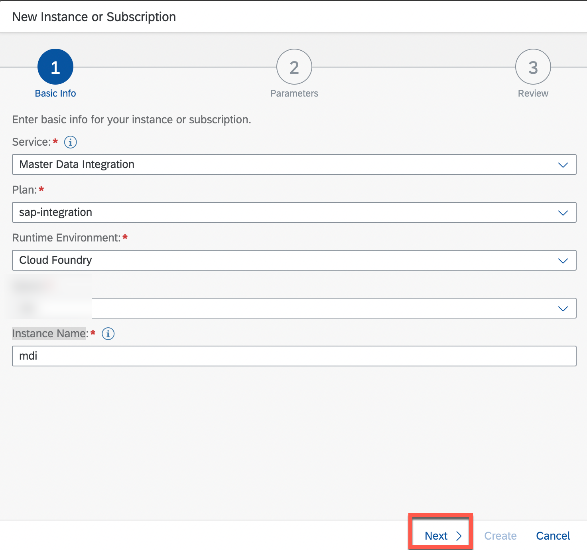

    7. In the **Configure instance parameters**, enter below JSON.

    ```json
        {
        "enableTenantDeletion": true,
        "writePermissions": 
            [
                {
                "entityType": "sap.odm.finance.costobject.CostCenter"
                }
            ]
        }
    ```
    8. Choose **Create**.

## 2. Create Master Data Integration Service Key.

Create a service key in the newly created service instance to obtain credentials to connect a client to the Master Data Integration service.

1. Choose **mdi** instance.
2. Choose the three dot icon, and choose **Create Service Key**.

    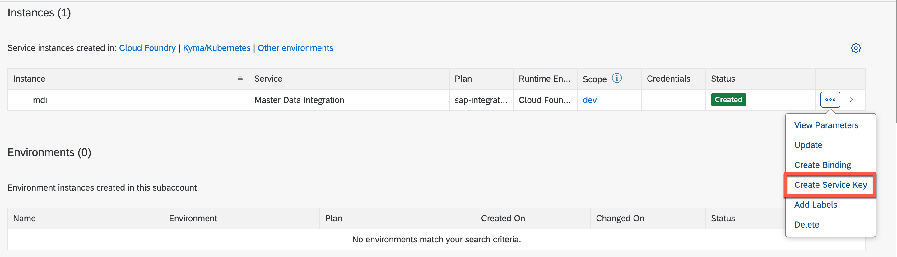

3. In the **New Service Key** wizard, enter below:

    1. In the **Service Key Name** field, enter **MDIKey**.
    2. Choose **Create**.

    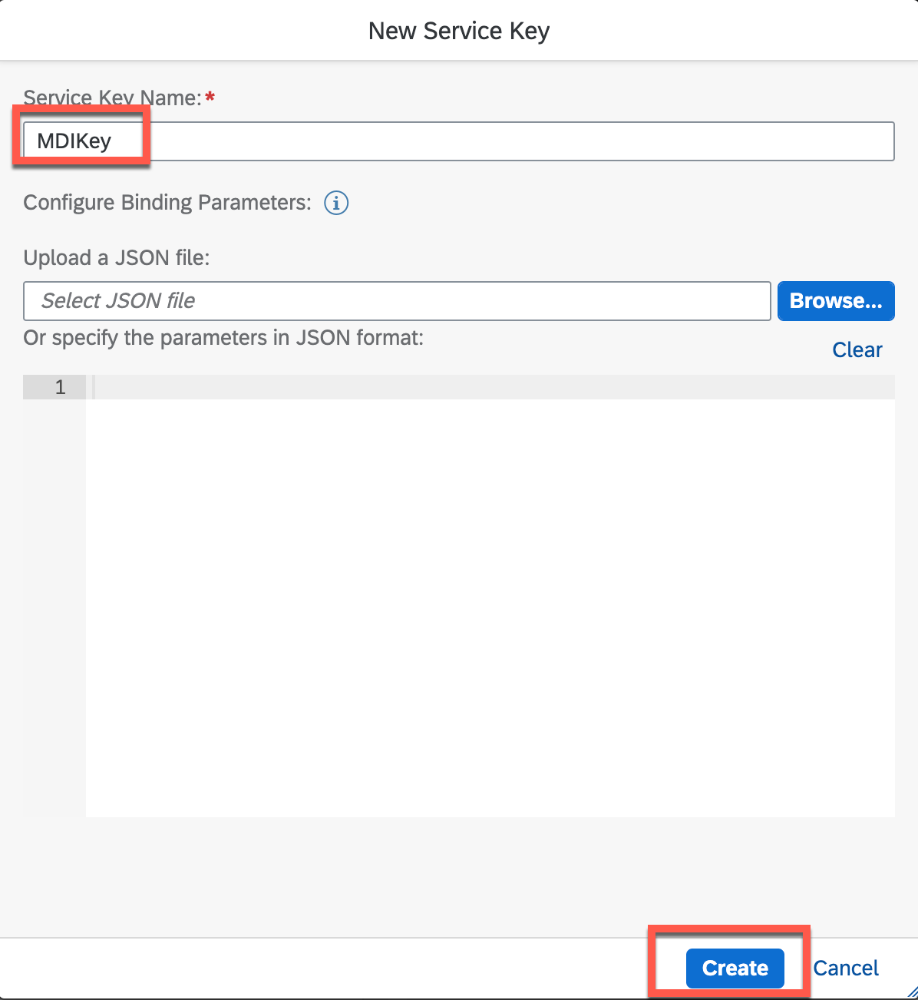

4. Once service key creation is finished, choose the key to see the credential and choose **Download**.

    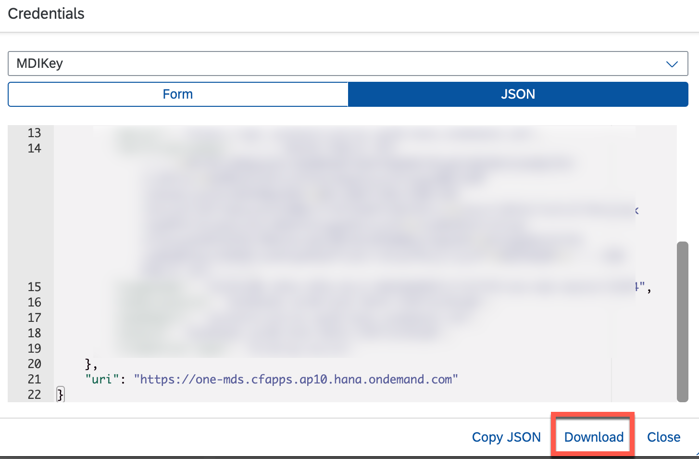

5. You will use this credential to setup credential in Cloud Integration.

## 3. Subscribe to Master Data Orchestration.

SAP Master Data Orchestration is a service that runs on the SAP Business Technology Platform. This service is used as a central place to configure the distribution of master data.

This section covers the steps to set up SAP Master Data Orchestration service. A subscription on the SAP Business Technology Platform cockpit is required to consume the service.

1. In the Subaccount, choose **Instances and Subscription**.
2. Choose **Create**.
3. In the **New Instance or Subscription** wizard, enter below:

    1. In the **Service** dropdown, choose **Master Data Integration (Orchestration)**.
    2. In the **Plan** dropdown, choose **Standard**.
    3. Choose **Create**

        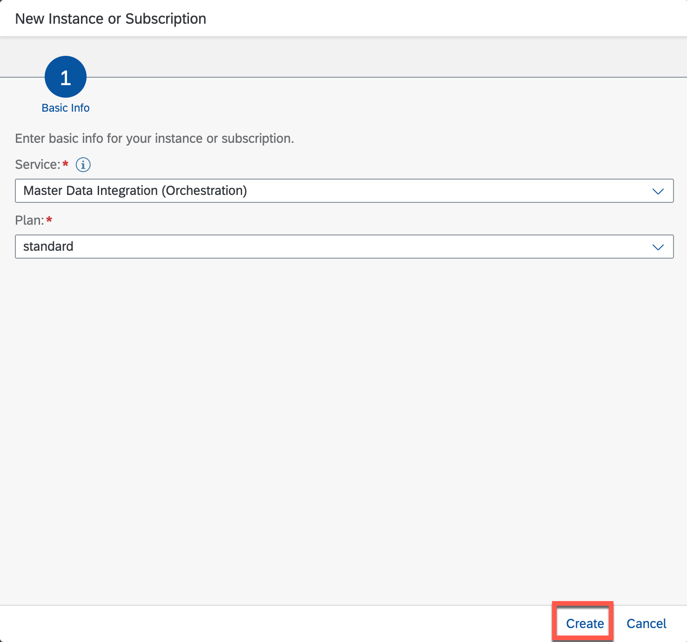

4. The Status will be changed to **Subscribed**
    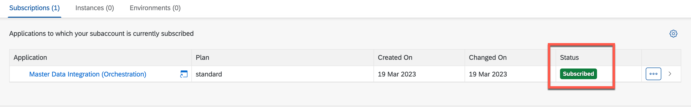

## 4. Add Master Data Orchestration Role.

The app tiles will not be displayed until the relevant security configuration has been carried out. The following steps have to be performed by a subaccount security administrator:

1. Choose **Role Collections**
2. Add below Roles.
    * MasterDataOrchestrationAdmin
    * MasterDataOrchestrationDisplay
3. Add user to Role Collections.
4. Choose **Save**.

    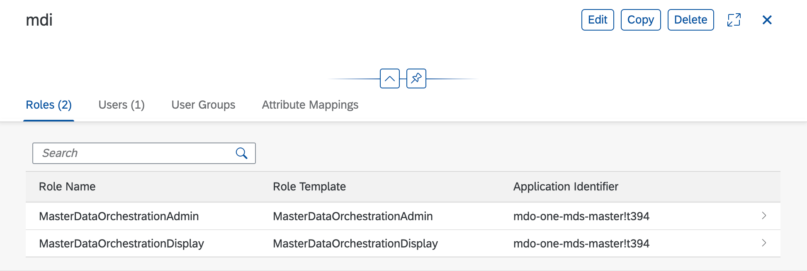

## 5. Configure Master Data Orchestration.

With this app, you can define and modify the distribution model. This includes information like business object type, activation status, recurrence, and filtering. With filtering, you can specify which master data will be distributed and determine the source and the target as well as at what point in time the model will be executed.

1. Open Master Data Orchestration Application.
2. Choose **Manage Distribution Model**.

    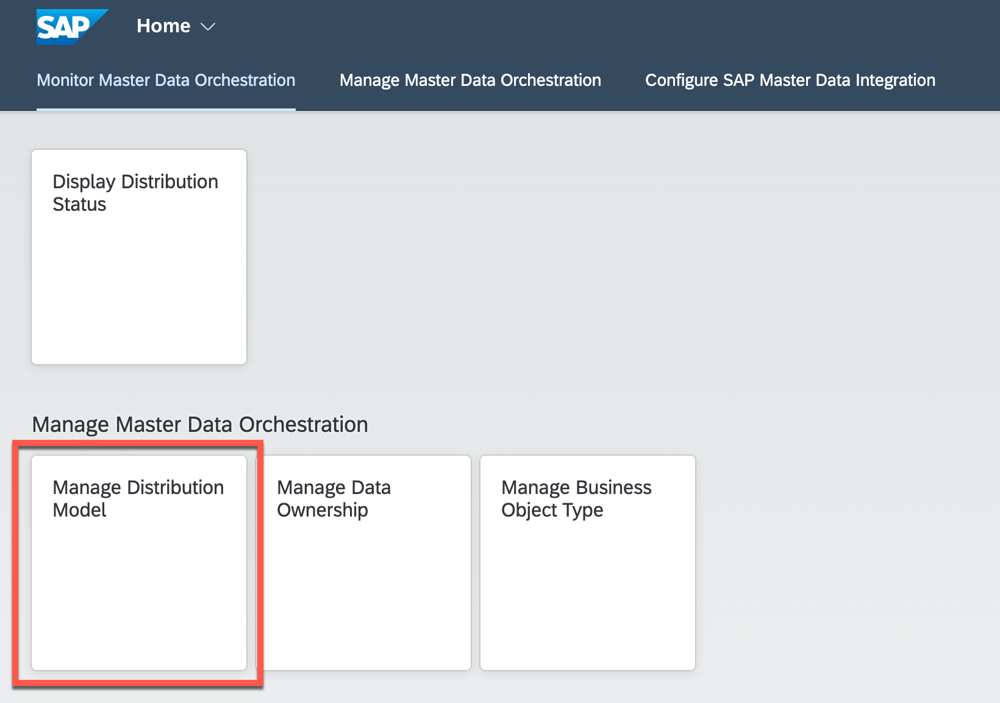

3. Choose **Create**.

    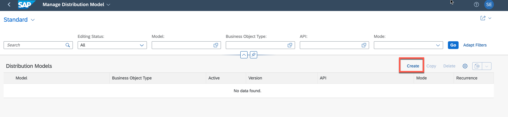

4. In the Wizard, enter below:

    1. In the **Header** Tab:
        - In the **Model** field, enter **MDICONF**.
    2. In the **Provider** Tab:
        - In the **Destination** field, choose **MDI**.
    3. In the **Consumer** Tab:
        - In the **Destination** field, choose **systemId of MDI**.
          > You will find systemId frm MDI Service Key
    4. In the **Parameters** Tab:
        - In the **Business Object Type** dropdown, choose **sap.odm.finance.costobject.CostCenter**.
        - In the **Mode** dropdown, choose **Pull**.
        - In the **API** dropdown, choose **MDI_LOG_COST_CENTER**.
        - Choose **Save**

        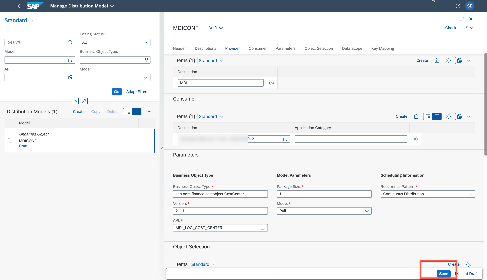

    5. Choose **Activate**.

        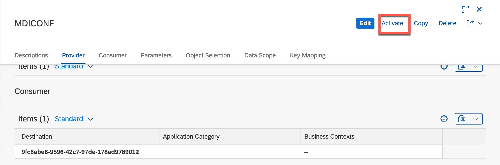

5. After successful activation, you can move to **Implement** phase.

    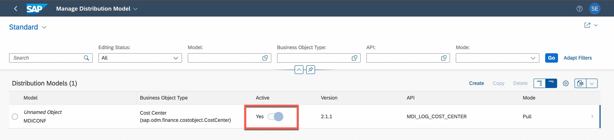
